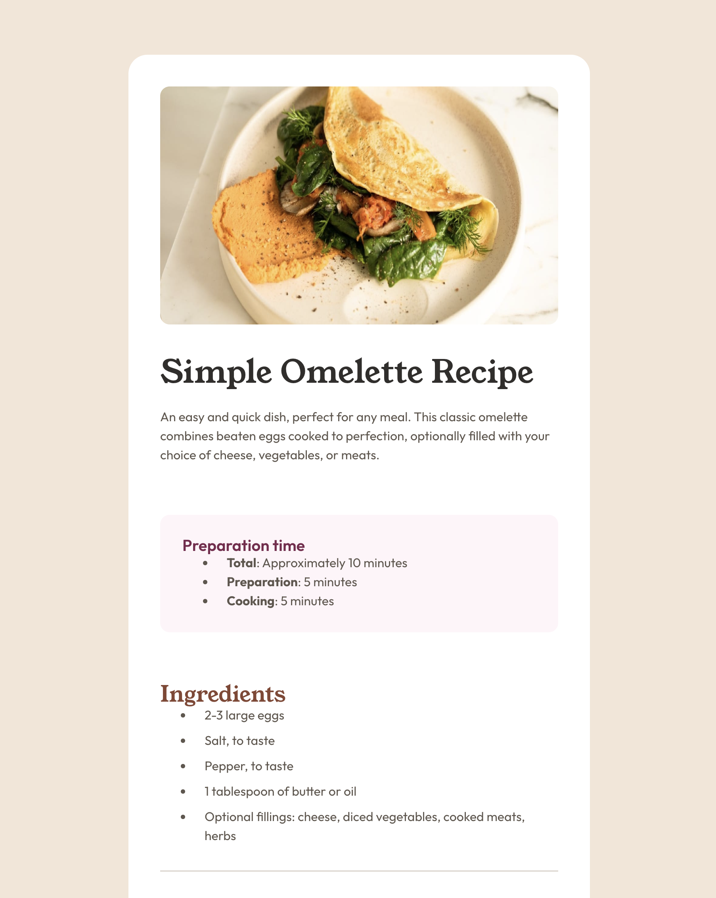

# Frontend Mentor - Recipe page solution

This is a solution to the [Recipe page challenge on Frontend Mentor](https://www.frontendmentor.io/challenges/recipe-page-KiTsR8QQKm). Frontend Mentor challenges help you improve your coding skills by building realistic projects.

## Table of contents

- [Overview](#overview)
  - [The challenge](#the-challenge)
  - [Screenshot](#screenshot)
  - [Links](#links)
- [My process](#my-process)
  - [Built with](#built-with)
  - [What I learned](#what-i-learned)
  - [Continued development](#continued-development)
- [Author](#author)

## Overview

### Screenshot

### Links

- Solution URL: [https://github.com/acandael/recipe-page](https://github.com/acandael/recipe-page)
- Live Site URL: [https://acandael.github.io/recipe-page/](https://acandael.github.io/recipe-page/)

## My process

### Built with

- Semantic HTML5 markup
- CSS custom properties
- Flexbox

**Note: These are just examples. Delete this note and replace the list above with your own choices**

### What I learned

This exercise was more difficult then it looked at first. Especially the ordered list with custom digital bullets was quite advanced.

### Continued development

My latest projects were all using Tailwind, so I used touched with CSS a bit. So I would love to dive deeper in modern CSS and the latest additions to the language.

Other areas I would like to involve in are web accessibility.

## Author

- Website - [https://www.webmooov.be](https://www.webmoov.be)
- Frontend Mentor - [@acandael](https://www.frontendmentor.io/profile/acandael)
- Twitter - [@acandael](https://www.twitter.com/acandael)
